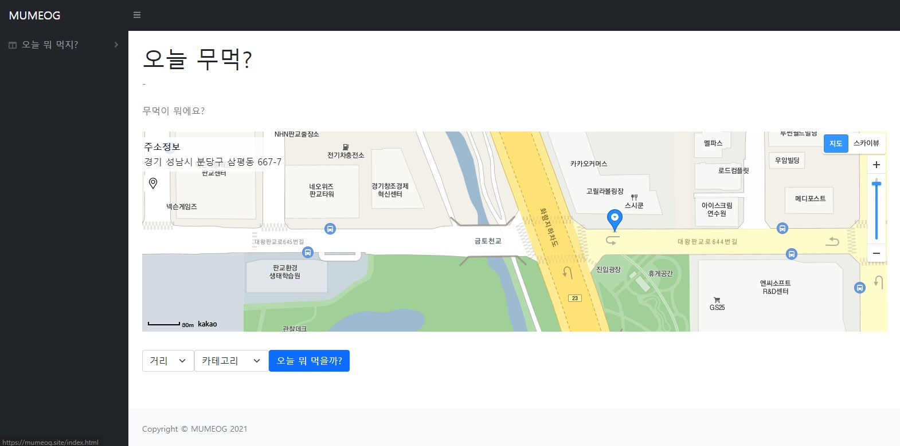
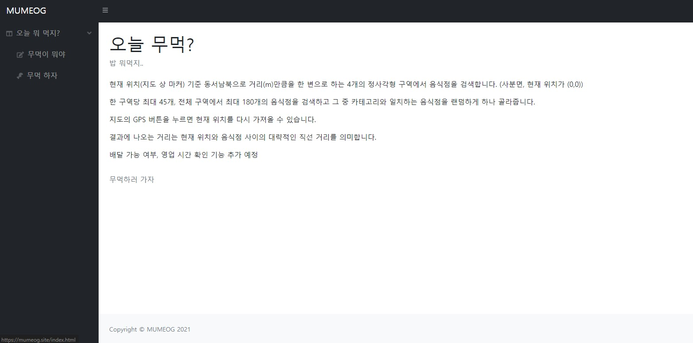
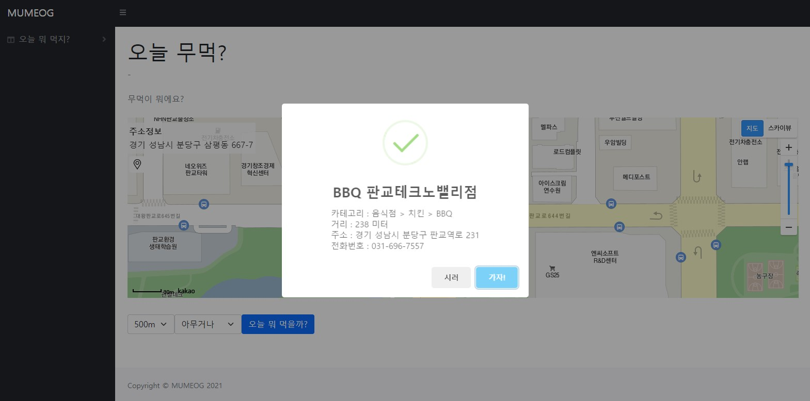

# 오늘 점심 뭐 먹지? 오점무? (OJM)

오늘 점심 뭐 먹을지 골라볼까

Domain : https://mumeog.site/

## 1. 개발 환경

- CentOS Linux release 7.9.2009 (Core)
- go version go1.17.3 linux/amd64
  - github.com/gin-gonic/gin v1.7.7
  - github.com/google/go-querystring v1.1.0

## 2. 기능 설명

오늘 점심 뭐 먹을지 골라주는 웹페이지

현재 위치(지도 상 마커) 기준 동서남북으로 거리(m)만큼을 한 변으로 하는 4개의 정사각형 구역에서 음식점을 검색합니다. (사분면, 현재 위치가 (0,0))

한 구역당 최대 45개, 전체 구역에서 최대 180개의 음식점을 검색하고 그 중 카테고리와 일치하는 음식점을 랜덤하게 하나 골라줍니다.

지도의 GPS 버튼을 누르면 현재 위치를 다시 가져올 수 있습니다.

결과에 나오는 거리는 현재 위치와 음식점 사이의 대략적인 직선 거리를 의미합니다.

배달 가능 여부, 영업 시간 확인 기능 추가 예정

### 2.1. 메인 페이지



### 2.2. 설명 페이지



### 2.3. 검색 결과 화면




## 3. Let's Encrypt(Certbot) 설치 및 인증서 발급

### 3.1. [Certbot 설치](https://certbot.eff.org/instructions)
### 3.2. SSL 인증서 발급 및 설정
    
        $ sudo certbot certonly --standalone -d {domain}

### 3.3. 인증서 갱신 테스트

        $ sudo certbot renew --dry-run

## 4. 스크립트

### 4.1. `monitor.sh`

서버 기동 확인 및 기동

- 현재 구동 중인 애플리케이션 확인
  - 정상 실행 중이라면 스크립트 종료
  - 구동 중인 애플리케이션이 없으면 애플리케이션 재구동

### 4.2. `start.sh`

서버 시작

- 순서
    1. git pull
    2. go 패키지 생성
    3. 현재 구동 중인 애플리케이션 확인
        - 실행 중인 애플리케이션이 있다면 종료
    4. 생성한 패키지 실행

### 4.3. `stop.sh`

서버 중단

- 순서
  1.  현재 구동 중인 애플리케이션 확인
      - 실행 중인 애플리케이션이 있다면 종료

### - `renew.sh`

인증서 갱신

- 순서
    1. 현재 애플리케이션이 구동 중이라면 종료
    2. SSL 인증서 갱신
    3. 애플리케이션 재실행


## 5. API

### __Request__

### __URL__

```
GET /api HTTP/1.1
Host: ojeommu.herokuapp.com
```

### __Query Parameter__

| Name  | Type   | Description                 | Required |
| ----- | ------ | --------------------------- | -------- |
| query | String | 검색을 원하는 질의어(UTF-8) | O        |
| cat   | String | 카테고리(아래 Cat 표 참고)  | X        |
| auth  | String | Kakao 앱 REST API 키(*)     | X        |

(*): auth 파라미터 미포함 시, 제 카카오 계정의 Key를 사용하고 있어서 할당량을 초과할 수 있습니다. 그 때 본인의 카카오 REST API Key를 auth 파라미터로 전달하면 본인의 Key를 이용할 수 있습니다. 전달받은 Key는 서버에 저장하지 않고 요청하는데 일시적으로 사용합니다.

### __Cat__

| Name     | Type​  | Description        |
| -------- | ------ | ------------------ |
| anything | String | 아무거나 (DEFAULT) |
| korea    | String | 한식               |
| china    | String | 중식               |
| japan    | String | 일식               |
| western  | String | 양식               |
| flour    | String | 분식               |
| asia     | String | 아시아음식         |
| lunchbox | String | 도시락             |
| meat     | String | 육류 & 고기        |
| chicken  | String | 치킨               |
| fastfood | String | 패스트푸드         |
| bar      | String | 술집               |


### __Response__

| Name    | Type   | Description                                     |
| ------- | ------ | ----------------------------------------------- |
| address | String | 지번 주소                                       |
| road    | String | 도로명 주소                                     |
| cat     | String | 카테고리 이름                                   |
| hdr     | String | 업체명                                          |
| lnk     | String | 장소 상세페이지 URL                             |
| phone   | String | 전화번호                                        |
| place   | String | 질의어를 카카오맵에 검색한 결과 중 첫 번째 장소 |
| d       | String | 기준 위치부터 음식점까지 직선거리(m)            |
| x       | String | X 좌표값, 경위도인 경우 longitude (경도)        |
| y       | String | Y 좌표값, 경위도인 경우 latitude(위도)          |
| status  | String | HTTP 상태 코드(에러 응답시에만)                 |
| reason  | String | HTTP 응답 Reason(에러 응답시에만)               |


### __요청 예시__
​
```
# https://ojeommu.herokuapp.com/api?query={질의어}&auth={REST_API_KEY}&cat={CAT}

# query는 UTF-8
curl -v -L "https://ojeommu.herokuapp.com/api?query=%EC%84%9C%ED%98%84%EC%97%AD&cat=korea&auth={API_KEY}"

```

### __응답 예시__

#### Request : 서현역 주변 한식 음식점 골라주기

```
https://ojeommu.herokuapp.com/api?query=서현역&cat=korea

{
  "address": "경기 성남시 분당구 서현동 88",
  "cat": "음식점 > 한식 > 육류,고기",
  "d": 116,
  "hdr": "됐소 서현점",
  "lnk": "http://place.map.kakao.com/26874327",
  "phone": "031-705-5676",
  "place": "서현역 수인분당선",
  "road": "경기 성남시 분당구 중앙공원로39번길 49",
  "x": "127.124752848021",
  "y": "37.3837994610632"
}
```

서현역으로 카카오맵에 검색한 결과 '서현역 수인분당선' 이 첫 번째 결과로 나왔고,

'서현역 수인분당선' 으로부터 약 500미터 반경의 한식 카테고리 음식점들 중 하나를 골라준 결과입니다.

​

